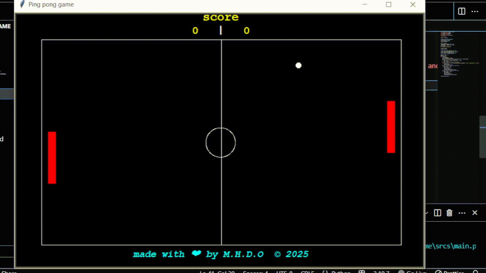

# Ping Pong Game - Python with Turtle Module

This is a simple Ping Pong game implemented using Python's `turtle` module. It features smooth gameplay with increasing speed and classic scoring mechanics.

## Features

- **Smooth Speed Increase**: The ball's speed increases gradually as the game progresses, providing a more challenging experience.
- **Classic Scoring**: Traditional Ping Pong scoring where points are awarded, and the game continues with each point.
- **Two-Player Mode**: Play with a friend or challenge yourself in single-player mode.

## Installation

### Requirements

- Python 3.x
- The `turtle` module (usually included with Python)

### Steps to Install

1. Clone the repository and Navigate to it:

   ```bash
   git clone https://github.com/Mohamed-ait-alla/python-ping-pong.git
   cd /path/to/directory/cloned
2. Ensure you have Python 3.x and turtle installed on your machine. If you're missing turtle, it can be installed via the following (although it usually comes pre-installed with Python):

   ```bash
    pip install turtle
## Usage

### Windows
1. Navigate to the builds directory.

2. Double-click the 'Ping Pong.exe' file to launch the game.

### Linux
1. Open your terminal.

2. Navigate to the project directory.

3. Run the game using Python:

   ```bash
   python3 srcs/main.py
<h2>Paddle Controls</h2>

- **Right Paddle Movement:** Use the Up Arrow (↑) and Down Arrow (↓) keys to move the right paddle up and down.
- **Left Paddle Movement:** Use the W (W) key to move the left paddle up and the S (S) key to move the left paddle down.
## Example Interaction

<p style="align: center;">
    
</p>

##  
<p style="font-weight: bold;">Feel free to play the game, and if you feel inspired, modify it to make it even better! Your creativity can help enhance the experience for everyone.</p>
